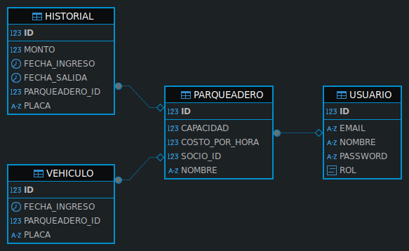

# API de Gestion de Parqueadero

  

Una API desarrollada en **Java** con **Spring Boot**, que permite realizar operaciones con relacion a un sistema de parqueaderos los datos son almacenados en una base de datos **H2**.La API está documentada utilizando **Swagger** y colecciones de postman e insomnia.

  

---

  

## 🚀 Funcionalidades

  

- **Gestión de Parqueaderos:**

Realiza operaciones de autenticacion, CRUD (Crear, Leer, Actualizar, Eliminar) sobre parqueaderos,vincular socios,registro de entrada y salida de vehiculos y consulta de indicadores. 

---

  

## 🛠 Requisitos

  

Antes de comenzar, asegúrate de cumplir con los siguientes requisitos:

  

1. **STS:** Tener [Spring Tool Suite](https://spring.io/tools) descargado en tu sistema. Puedes usar cualquiera de las versiones yo utilice Spring Tools 4 for Eclipse.

2. **Código del Proyecto:**

- **Opción 1:** Clonar este repositorio usando el comando:

```bash

	git clone https://github.com/JuanPabloOrtizJaimes/parqueadero-sistema.git

```

- **Opción 2:** Descargar el archivo ZIP del proyecto y descomprimirlo.


---

  

## 🏃‍♂️ Pasos para Ejecutar

  
1. Abre Spring Tool Suite.
2. Luego en File --> Open projects from File System... --> Directory
3. Navega a la carpeta del proyecto donde hayas clonado o descomprimido y abrela.
4. Luego de haber cargado los proyectos de apicorreo y parqueadero espera a que se resuelvan las dependencias.
5. Ejecuta ambas aplicaciones 
6. Accede a la interfaz de Swagger para explorar y probar la API:

	[Swagger UI](http://localhost:8088/api/v1/swagger-ui/index.html)

7. O puede usar Postman o Insomnia importando las collecciones:

	[Descargar colección de Postman](Parqueadero_postman_collection.json)
	
	[Descargar colección de Insomnia](Parqueadero_Insomnia_collection.json)

---
  

## 🧑‍💻 Tecnologías Utilizadas

  

- **Java:** Lenguaje principal del proyecto.  
- **Spring Boot:** Framework para el desarrollo rápido y robusto de aplicaciones web.  
- **H2 Database:** Base de datos en memoria o persistente utilizada para almacenar los parqueaderos,vehiculos,usuarios e historial.
- **Swagger:** Documentación interactiva para APIs.  


  

---

  

## 📚 Estructura del Proyecto

```
/apicorreo
├── src/                # Código fuente principal
│   ├── main/           # Código de la aplicación
├── pom.xml             # Dependencias y configuración de Maven
├── README.md           # Documentación del proyecto
└── ...                 # Otros archivos del proyecto
/parqueadero
├── src/                # Código fuente principal
│   ├── main/           # Código de la aplicación
├── pom.xml             # Dependencias y configuración de Maven
├── README.md           # Documentación del proyecto
└── ...                 # Otros archivos del proyecto
```
---

## Modelo 👽 Relacion
---


## 👥 Autor

- [Juan Pablo](https://github.com/JuanPabloOrtizJaimes)

